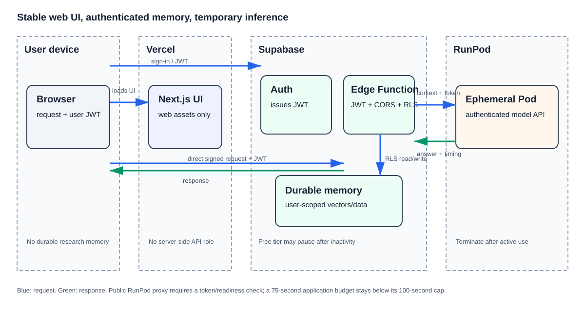

# Vercel, Supabase, and RunPod deployment design

**Decision date:** 2026-09-09  
**Status:** approved direction; implementation not yet started

## Decision

Deploy the browser application as a Next.js web app on Vercel. Use Supabase for user authentication, durable user-scoped memory, and an authenticated Edge Function that performs memory retrieval and the routing decision. Use a RunPod Pod only as the self-hosted inference server while an experiment, rehearsal, or demo is active.

This keeps the stable public surface inexpensive while preserving the project’s goal of configuring and measuring an actual model server. It also keeps durable memory independent of GPU lifecycle: terminating a Pod must not remove a user's memory.

## Verified claims — checked 2026-09-09

- Vercel deploys Git-connected projects with preview deployments for pushes/PRs and a production deployment from the configured production branch. This repository will use previews for pull requests and `main` for production. Source: [Vercel Git deployment documentation](https://vercel.com/docs/git).
- A signed-in client invoking a Supabase Edge Function sends its session JWT. Supabase documents the authenticated `user` mode as providing an RLS-scoped client; the function must keep user authorization enabled rather than use an unrestricted endpoint. Source: [Supabase Edge Function authentication](https://supabase.com/docs/guides/functions/auth).
- Supabase documents Edge Functions as server-side TypeScript functions and documents JWT verification/auth handling at its edge gateway. Source: [Supabase Edge Functions overview](https://supabase.com/docs/guides/functions).
- Supabase documents that browser-invoked Edge Functions need CORS preflight handling; `withSupabase` handles CORS and `OPTIONS` requests for authenticated user functions. Source: [Supabase Edge Function CORS](https://supabase.com/docs/guides/functions/cors).
- A RunPod Pod HTTP proxy is public and has a 100-second connection limit; RunPod instructs users to add application authentication. This design sets a lower 75-second request budget. Source: [RunPod port-exposure documentation](https://docs.runpod.io/pods/configuration/expose-ports).
- Supabase pauses Free Plan projects with low activity after seven days. Source: [Supabase Free Project Pausing](https://supabase.com/docs/guides/platform/free-project-pausing).

## Component inventory

| Component | Responsibility | Communicates with |
| --- | --- | --- |
| Browser | Renders the UI and sends a signed request | Vercel, Supabase Auth/Edge Function |
| Vercel + Next.js | Hosts the public web interface and PR previews | Browser; Supabase public client configuration |
| Supabase Auth | Establishes the user session/JWT | Browser, Edge Function |
| Supabase Edge Function | Verifies the caller, performs RLS-scoped memory access, makes the controller decision, and calls inference | Browser, Supabase database, RunPod |
| Supabase database / `pgvector` | Retains user-scoped memory and vectors | Edge Function |
| RunPod Pod | Runs the selected open-weight model and returns generation/timing data | Edge Function |
| RunPod Network Volume | Optionally caches non-sensitive weights and setup | RunPod Pod only |

## Data flow and boundaries

1. The browser loads the Vercel-hosted UI and signs in directly with Supabase Auth.
2. The browser invokes the Edge Function directly with the user JWT and a completed request; Vercel is not in this API call path.
3. The Edge Function validates/authenticates the caller, retrieves only RLS-authorized memory, and chooses the small/no-memory, small/retrieve, or large/retrieve condition.
4. The Edge Function sends the selected request and retrieved context—but no Supabase credential or user JWT—to the active RunPod model server.
5. RunPod returns the generated answer and inference timing. The Edge Function returns the result to the browser and writes approved memory/aggregate telemetry through Supabase.

**Retained:** user-scoped memory and approved telemetry in Supabase; source code and aggregate artifacts in GitHub.  
**Transient:** request processing in the Edge Function; prompt/context and inference state on RunPod; the Pod itself.  
**Never committed:** credentials, user JWTs, raw personal conversations, or private RunPod endpoint details.

## Security and deployment controls

- The Edge Function must require a signed-in user and use RLS-scoped database access. Keep `verify_jwt` enabled and use `withSupabase({ auth: 'user' })`, which handles the authenticated browser CORS/`OPTIONS` flow. Service-role access is not used for ordinary user requests.
- A RunPod HTTP proxy is publicly reachable, so the model server must reject requests without its inference token. It must also apply request-size limits, payload validation, and per-token rate limiting before initiating inference: start with a 64 KiB request ceiling, 12 requests per minute, and two concurrent requests per token. The RunPod proxy URL and a per-deployment inference token live only in Supabase Edge Function secrets; Vercel has no server-side role in this call path. Rotate the token whenever a Pod is redeployed or a secret may have been exposed.
- Do not expose the Pod as ready until RunPod telemetry and the authenticated `/healthz` check succeed. The initial HTTP-proxy request budget is 75 seconds, below RunPod’s 100-second proxy limit. Requests that cannot complete in that budget return a clear retry-later result; long-running jobs are out of scope for the first demo.
- Vercel holds only public client configuration. Supabase secrets and the RunPod service credential never enter browser code or Git.
- A Vercel preview is useful for UI review but does not authorize a public live-model demo. The interface must show that the demo is unavailable whenever the RunPod Pod is terminated.
- Because a Free Plan Supabase project can pause after inactivity, the UI must show a clear service-unavailable message for that state without retry loops or data loss. Before a scheduled demo, the project owner resumes it in Supabase Studio and verifies Auth, the Edge Function, and database access.

## Measurement boundary

Record UI/network, Edge Function, Supabase retrieval, and RunPod inference timings separately. The evaluation should report the external Supabase round trip rather than hiding it inside model latency.

## Unverified assumptions

- Exact Vercel project/account configuration, custom domain, and any paid usage are not chosen; confirm before enabling production hosting.
- The exact Edge Function runtime budget and region behavior for the final workload need verification against the selected Supabase plan before implementation.
- The exact inference-token implementation and secure rotation mechanism must be selected and tested before deployment; the initial HTTP-proxy design is bounded by the 75-second request budget.
- The `pgvector` schema, RLS policies, retention window, and consent boundary must be specified and tested before any non-synthetic memory is stored.
